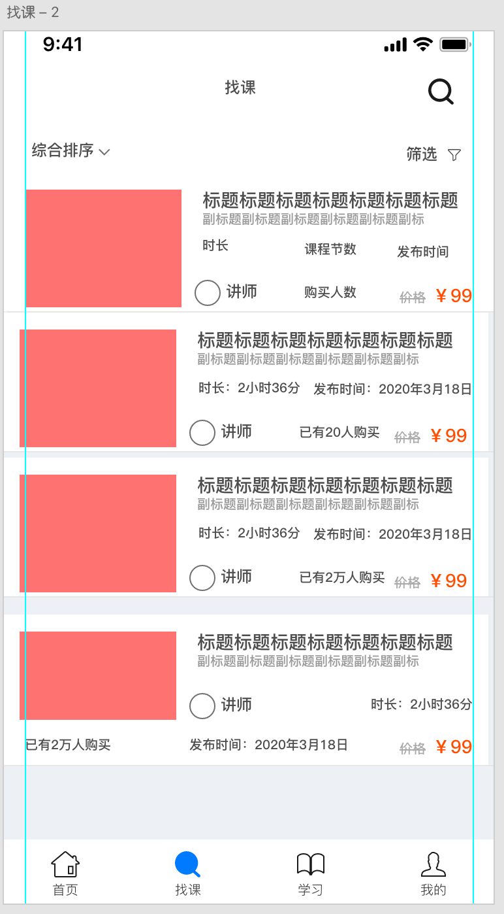
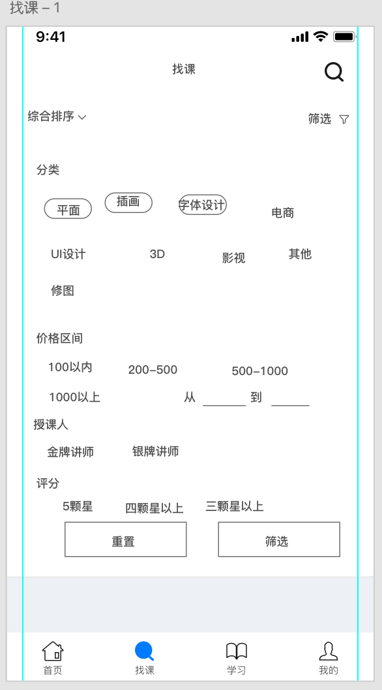

# APP设计-信息结构

知识点

- 上节回顾（检查作业）
- 作业点评（×）
- 什么是产品经理
- 今日单词


## 什么是产品经理

**APP项目的诞生过程**

- 需求（产品经理）
  - PRD: 产品 需求 文档
    - 
- 研发
  - 设计：GUI设计师 
  - 开发（开发：前端、后端开发）
- 测试
- 运营反馈

## 案例：找课页面信息排版

找课页面：



排序版式：


筛选版式：



## 今日单词

- PM: 产品经理
  - Product Manager 产品   管理者


## 备注

```html
dangqianjieshu/zongjieshu  变量/变量 （

4/30   常量/常量

```


