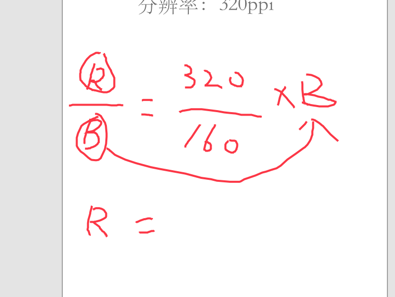

# APP设计：我的页面

知识点

- 上节回顾
- WUI设计中如何设置字体
- 我的页面设计
- 安卓设计规范
- 试卷
- 今日单词
- 作业
  - 安卓分辨率按大小排序（交腾讯文档到QQ群）
  - 完善”我的“页面下的所有页面

## WUI设计中如何设置字体

WUI: Web UI

网页原型图中使用的字体跟什么有关？

思考

- 我们使用的字体：微软雅黑  Arial(英文)
- 原因
  - 微软雅黑是迄今为止windows平台上出现的最清晰的中文（ 宋体-win7-微软雅黑）
  - 市场上使用windows的用户最多
- 这样做的正确？
  - 正确，但是不严谨
- 应该如何设置：
- 网页展示的平台：
  - windows系统上：微软雅黑
  - Mac OS系统：苹果丽黑
  - Linux系统
  - Andriod系统：思源黑体
  - IOS系统：苹方
  - iPad OS系统：苹方
- 网页设置字体的原则：使用系统默认字体

```css
body{
  font-family:-apple-system,SF UI Text,Arial,PingFang SC,Hiragino Sans GB,Microsoft YaHei,WenQuanYi Micro Hei,sans-serif
}
```

## 安卓设计规范

安卓简介

- 公司：谷歌（收购）
- 基于：linux系统（开源系统）
- 是否开源：开源
- 应用领域：手机、平板、TV、游戏机、相机等。
- 11年全球份额超过塞班
- 最新版：andriod 11 (2020年2月)

## 分辨率

- 1080×1920 ：13%

- 720×1280 ：6.58%
- 1080×2340 ：2.89%
- 720×1440 ：2.2%
- 1080×2139 ：2.16%

分析

- 最小宽度：720
- 最大高度：2340
- 最小高度：1280

设计尺寸

- 1080*1920
- 原因
  - 中间值，向上向下易扩展
  - 市场份额最高

## 单位

安卓开发单位：

- DP: 
  - 安卓开发专用的长度单位
  - DP：与设备/密度无关的像素
    - device independent pixle: 设备 独立 像素
    - Density independent pixle:密度 独立 像素
    - DP也叫DIP
  - 1DP=1PX
    - Px:逻辑像素
    - 等式成立的条件：分辨率160ppi 
    - 计算公式：dp/px =  ppi/160
      - 例：x/48 = 320/160  = 2/1
- SP：安卓开发专用的字体大小单位
- 

## 安卓字体

- 简体中文：思源黑体
- 英文：Roboto

## 标签栏

关于主导航和二级导航的区别

- Ios主导航：标签栏
- ios次导航：导航栏、二级菜单

IOS（原生规范）

- 位置：屏幕底部
- 数量：3-5个标签
- 标签字号：10pt
- 标签是一个名词（不是动词）

IOS(第三方扩展规范)

- 动作按钮放在居中位置
- 我的：最后一个标签（IOS不推荐放这里）
- 搜索：放在第二个标签的位置（IOS推荐放在最后一个）

Android（原生）

安卓的标签栏是主导航。但是分布的位置有四个位置

- 汉堡菜单
- 顶部标签栏
- 浮动按钮菜单
- 搜索栏

安卓也使用底部标签栏，差异不明显。

## 导航栏

IOS

- 尺寸
- 位置
- 任务：告知用于当前的位置
- 文字标题：位置
  - 左侧：首屏展示在左侧
  - 居中：向上滑动时居中
- 左侧是一个动作：返回（文本+图标）
- 右侧是主要动作：文本+图标

Andriod

- 高度：56px

- 标题和返回在左侧
- 主要动作在右侧：图标（不推荐文字）

## 二级菜单

IOS

- 位置
  - 底部标签栏最后一个标签：more 或者 更多
  - 导航栏的右侧： more  或 更多...

Andriod

- 位置：汉堡菜单
- Obvious always wins

## MD 组件库

结构

- 底部应用程序栏
- 顶部应用程序栏
- 背景
- banner
- button
- 浮动按钮 float a? button
- 底部导航栏
- 卡片
- 对话框（弹窗）
- 图片
- 列表
- 菜单
- 抽屉式导航
- 进程指示符
- 选择控件
- sheet
- Slider 滑动控件
- Snackbar?????????
- 标签
- 输入文本控件

## 我的页面设计

- 场景：我的
- 分析场景
  - 用户个人基本信息
  - 用户个人附加功能信息
  - 系统信息
- 目标：清晰有效的管理个人信息和系统信息。
- 基本信息
  - 头像
  - 昵称
  - 账号名称
  - 个人签名
  - 二维码名片
- 附加信息
  - 优惠券
  - 余额
  - 课程分销
- 系统信息
  - 反馈建议
  - 关于（版本号）
  - 帮助
  - 设置


## 今日单词

Andriod: 安知哦的 安卓

Linux: 是一个人名 现在以他的名字命名操作系统。“Talk is cheap, show me the code."

Chips: 薯片

Avata: 阿凡达 （头像）